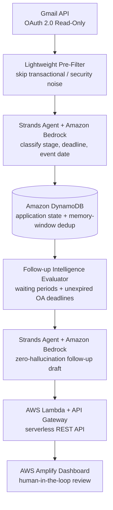
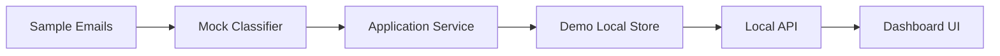
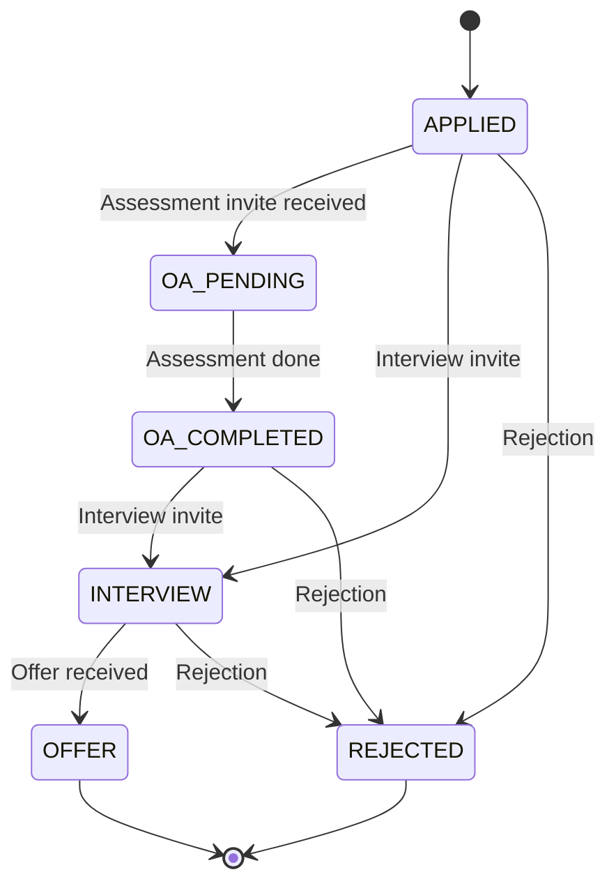

# CareerPilot — Internship & Job Application Tracker with an Auto-Follow-Up Agent

> **An agentic, human-in-the-loop assistant that watches your inbox, tracks every application as a state machine, and drafts (never auto-sends) polite follow-ups at exactly the right time.**
>
> Built for the **AWS National-Level Hackathon** · Theme: *Career — Internship / Interview Loop Tracker*


**Stack at a glance:** Gmail API → Strands Agents SDK + Amazon Bedrock (Claude 3 Haiku) → Amazon DynamoDB → AWS Lambda + API Gateway → AWS Amplify dashboard

---

## Table of Contents

1. [The Problem](#1-the-problem)
2. [The Solution](#2-the-solution)
3. [Quick Start: Demo Mode](#3-quick-start-demo-mode-no-aws-or-gmail-credentials-required)
4. [Architecture](#4-architecture)
5. [How It Works — Stage by Stage](#5-how-it-works--stage-by-stage)
6. [The Application State Machine](#6-the-application-state-machine)
7. [Follow-Up Intelligence](#7-follow-up-intelligence)
8. [Zero-Hallucination Draft Generation](#8-zero-hallucination-draft-generation)
9. [The Dashboard](#9-the-dashboard)
10. [AWS Services Used](#10-aws-services-used)
11. [Tech Stack](#11-tech-stack)
12. [Environment Configuration](#12-environment-configuration)
13. [How to Run](#13-how-to-run)
14. [Security, Privacy & Human-in-the-Loop Safeguards](#14-security-privacy--human-in-the-loop-safeguards)
15. [Cost Controls](#15-cost-controls)
16. [Design Decisions](#16-design-decisions)
17. [Roadmap](#17-roadmap)

---

## 1. The Problem

Every student applying for internships ends up with the same mess:

- Applications are **scattered** across email, LinkedIn, company portals, and spreadsheets.
- **Online Assessment (OA) deadlines** get buried in long email threads and are missed.
- Students **forget to follow up**, or follow up too early or too late.
- Nobody has a single, trustworthy answer to *"Where do I stand with each company right now?"*

Manual spreadsheets go stale the moment life gets busy, and the cost of a missed OA or a forgotten follow-up is a missed opportunity.

## 2. The Solution

CareerPilot turns your inbox into a live, per-company application pipeline:

| Capability | What it does |
|---|---|
| **Inbox watching** | Reads career-related emails through the Gmail API (OAuth 2.0, read-only). |
| **Smart classification** | An AI agent classifies each thread: application stage, assessment deadline, and event dates. |
| **Per-application tracking** | Each company's application is stored as a record whose status only moves forward. |
| **Follow-up intelligence** | Rules decide when a follow-up is appropriate, and skip it when it isn't (e.g., an OA deadline hasn't expired yet). |
| **Draft generation** | The agent drafts a polite follow-up grounded strictly in known facts. |
| **Human-in-the-loop dashboard** | You review, copy, mark as sent, or dismiss. **CareerPilot never sends email on your behalf.** |

---

## 3. Quick Start: Demo Mode (No AWS or Gmail Credentials Required)

Demo Mode lets anyone (including judges) clone the repository and run the full end-to-end workflow and dashboard locally, using representative sample emails and deterministic mock AI responses. **Zero AWS credentials, zero Gmail OAuth, and zero Bedrock API calls are required.**

```bash
# 1. Clone & install dependencies
git clone https://github.com/Atharva7115/TrackFlow.git
cd TrackFlow
npm install

# 2. Run Demo Mode
npm run demo
```

Then open **http://localhost:3001** in your browser.

**What Demo Mode does:**

- Loads 4 representative sample career emails (Google, Microsoft, Amazon, Meta).
- Processes classifications, status progression, and assessment deadlines locally.
- Evaluates follow-up eligibility and generates a follow-up draft for Meta.
- Launches the local HTTP dashboard server on port 3001.
- Demonstrates the interactive UI features: **Copy Draft**, **Mark as Sent**, and **Dismiss**.

**Why Demo Mode exists:** a hackathon project that only works with private credentials can't be evaluated. Demo Mode runs the *same* application service, status logic, and follow-up evaluator as production. Only the edges are swapped (sample emails instead of Gmail, a mock classifier instead of Bedrock, a local store instead of DynamoDB).

---

## 4. Architecture



**Demo Mode pipeline (no credentials):**



The production and demo pipelines share the same core: the **Application Service** and **Follow-up Evaluator**. This keeps the demo honest and makes every AWS component swappable behind a clean interface.

---

## 5. How It Works — Stage by Stage

### Stage 1 — Email Ingestion (Gmail API)

- Uses the Gmail API v1 via `googleapis` with **read-only** OAuth 2.0 scope.
- The search window and volume are configurable (`GMAIL_QUERY`, default `newer_than:30d`; `GMAIL_MAX_RESULTS`, default `20`).
- Email bodies are truncated to a safe limit (`MAX_EMAIL_BODY_CHARS`) before further processing.

### Stage 2 — Lightweight Pre-Filter

Before any AI call is made, a cheap deterministic filter skips obvious noise such as transactional and security emails (password resets, receipts, sign-in alerts). This reduces cost, latency, and the chance of misclassification.

### Stage 3 — AI Classification (Strands Agents SDK + Amazon Bedrock)

For each surviving email, a Strands agent backed by Claude 3 Haiku on Amazon Bedrock extracts structured information:

- **Company** the email relates to
- **Application stage** (applied, assessment, interview, offer, rejection, etc.)
- **Deadline** (for example, an OA due date)
- **Event date** (for example, an interview slot)

Outputs are validated with **`zod`** schemas, so malformed or unexpected model output is rejected instead of silently corrupting your data.

### Stage 4 — State Tracking (Amazon DynamoDB)

Each application is persisted in DynamoDB. Two protections apply:

- **Forward-only status progression:** a stale or out-of-order email cannot move an application backwards.
- **Memory-window deduplication:** already-processed emails and repeated threads don't create duplicate updates.

### Stage 5 — Follow-Up Evaluation

A deterministic evaluator checks whether a follow-up is warranted (see [Section 7](#7-follow-up-intelligence)).

### Stage 6 — Draft Generation & Dashboard

For eligible applications, the agent drafts a follow-up message. The result is served through a serverless REST API (Lambda + API Gateway) to the Amplify-hosted dashboard, where **you** decide what happens next.

---

## 6. The Application State Machine

Every application behaves like a small state machine, updated by parsed emails:



> ⚠️ *Stage names above are illustrative of the flow; keep them aligned with the exact enum values in the codebase.*

**Key rules**

- **Forward-only:** status can advance but never regress. A late "application received" email will not reset an application that is already at the interview stage.
- **Per-company records:** each company has its own state, deadlines, and follow-up history.
- **Event-driven updates:** state changes only when a classified email provides evidence for it.

This is the core idea: the agent doesn't just summarize emails, it **maintains a durable, auditable state** per application and acts on it.

---

## 7. Follow-Up Intelligence

Knowing *when* to follow up is as important as writing the message. The evaluator is rule-based and predictable:

| Stage | Follow-up threshold (default) | Env variable |
|---|---|---|
| `APPLIED` | 14 days of inactivity | `FOLLOWUP_DAYS_APPLIED` |
| `OA_COMPLETED` | 7 days of inactivity | `FOLLOWUP_DAYS_OA_COMPLETED` |
| `INTERVIEW` | 7 days of inactivity | `FOLLOWUP_DAYS_INTERVIEW` |

**Guard rails**

- A follow-up is **not** suggested while an assessment deadline is still **unexpired**. You'd be nudging a company about something you still owe them.
- Applications in terminal states (offer / rejection) don't trigger follow-ups.
- All thresholds are configurable through environment variables.

---

## 8. Zero-Hallucination Draft Generation

Follow-up emails go out under a student's name, so an invented detail is unacceptable. The drafting agent is constrained to:

- Use **only facts already stored** for the application (company, stage, dates from real emails).
- Avoid inventing interviewers' names, roles, dates, or commitments.
- Produce a **short, polite, professional** message that you can edit before sending.

Because drafts are never auto-sent, the human reviewer is the final safeguard against any error.

---

## 9. The Dashboard

A lightweight candidate dashboard (served from `public/`, hosted on AWS Amplify in production and on `localhost:3001` in demo) shows your pipeline at a glance and lets you act on suggestions:

| Action | Behavior |
|---|---|
| **Copy Draft** | Copies the generated follow-up to your clipboard so you can send it from your own email client. |
| **Mark as Sent** | Records in DynamoDB that *you* manually sent the follow-up, so it won't be suggested again. |
| **Dismiss** | Removes the suggestion when it isn't relevant. |

<!-- Add screenshots here:


-->

---

## 10. AWS Services Used

| Service | Role in CareerPilot |
|---|---|
| **Amazon Bedrock** | Runs Claude 3 Haiku for email classification and draft generation. |
| **Amazon DynamoDB** | Stores application state, deadlines, and deduplication memory. |
| **AWS Lambda** | Hosts the serverless API handlers. |
| **Amazon API Gateway** | Exposes the REST API to the dashboard. |
| **AWS Amplify Hosting** | Hosts the frontend dashboard. |
| **AWS SAM** (`template.yaml`) | Infrastructure-as-code for the serverless backend. |

**Why Claude 3 Haiku on Bedrock?** Classification and short-form drafting are high-volume, low-complexity tasks where a fast, inexpensive model is the right fit.

---

## 11. Tech Stack

- **Runtime:** Node.js (v18+)
- **Language:** TypeScript (strict mode, ES2022 / NodeNext)
- **Email Ingestion:** `googleapis` (Gmail API v1)
- **AI Agent Framework:** `@strands-agents/sdk` (Strands Agents SDK for TypeScript)
- **Foundation Model:** Amazon Bedrock (`us.anthropic.claude-3-haiku-20240307-v1:0`)
- **Database:** Amazon DynamoDB (`@aws-sdk/client-dynamodb`, `@aws-sdk/lib-dynamodb`)
- **Serverless & API:** AWS Lambda, Amazon API Gateway, AWS SAM
- **Frontend Hosting:** AWS Amplify Hosting (`public/`)
- **Schema Validation:** `zod`
- **Environment & CLI:** `dotenv`, `tsx`

---

## 12. Environment Configuration

Copy `.env.example` to `.env` for live production ingestion:

| Variable | Default | Description |
|---|---|---|
| `GMAIL_QUERY` | `newer_than:30d` | Gmail search query |
| `GMAIL_MAX_RESULTS` | `20` | Max emails to fetch from Gmail |
| `AWS_REGION` | `us-east-1` | AWS region for Bedrock & DynamoDB |
| `BEDROCK_MODEL_ID` | `us.anthropic.claude-3-haiku-20240307-v1:0` | Amazon Bedrock model ID |
| `AI_MAX_EMAILS` | `5` | Cost-control limit on emails sent to AI |
| `MAX_EMAIL_BODY_CHARS` | `12000` | Safety truncation limit for email bodies |
| `DYNAMODB_TABLE_NAME` | `CareerPilot-Applications` | DynamoDB table name |
| `FOLLOWUP_DAYS_APPLIED` | `14` | Inactivity threshold for APPLIED stage follow-up |
| `FOLLOWUP_DAYS_OA_COMPLETED` | `7` | Inactivity threshold for OA_COMPLETED stage follow-up |
| `FOLLOWUP_DAYS_INTERVIEW` | `7` | Inactivity threshold for INTERVIEW stage follow-up |

---

## 13. How to Run

| Goal | Command |
|---|---|
| Local Demo Mode (zero credentials) | `npm run demo` |
| Full test suite | `npm test` |
| Production CLI pipeline (needs AWS & Gmail credentials) | `npm run dev` |
| Local development server | `npm run server` |
| Typecheck | `npm run typecheck` |
| Build | `npm run build` |

**Production setup outline**

1. Create Gmail OAuth credentials (read-only scope) and save them as `credentials.json`.
2. Enable Amazon Bedrock model access for Claude 3 Haiku in your AWS region.
3. Copy `.env.example` to `.env` and fill in the values.
4. Deploy the backend with AWS SAM using `template.yaml`.
5. Deploy `public/` to AWS Amplify Hosting.
6. Run `npm run dev` to ingest and process emails.

---

## 14. Security, Privacy & Human-in-the-Loop Safeguards

- **Human-in-the-loop only:** CareerPilot **never** automatically sends emails. "Mark as Sent" only records that the candidate manually took the action.
- **Read-only Gmail access:** the OAuth scope cannot send, modify, or delete mail.
- **Zero credential exposure:** `.env`, `credentials.json`, `token.json`, and `.aws-sam/` are strictly excluded from Git.
- **Noise filtering before AI:** transactional and security emails are dropped before any model call.
- **Validated AI output:** structured responses are checked with `zod`, and drafts use stored facts only.
- **Bounded input:** email bodies are truncated (`MAX_EMAIL_BODY_CHARS`) before processing.

---

## 15. Cost Controls

Bedrock calls are the main variable cost, so CareerPilot limits them at several layers:

1. **Pre-filter** removes irrelevant emails before AI.
2. **`AI_MAX_EMAILS`** caps how many emails are sent to the model per run.
3. **Deduplication** prevents re-processing the same thread.
4. **Small, fast model** (Claude 3 Haiku) for classification and drafting.
5. **Demo Mode** makes zero Bedrock calls.

---

## 16. Design Decisions

| Decision | Reasoning |
|---|---|
| **Drafts, never auto-send** | Career communication is high-stakes and personal; the user stays in control. |
| **Forward-only state** | Emails arrive out of order; the pipeline must be robust to that. |
| **Deterministic follow-up rules + AI drafting** | Rules decide *when*, the model decides *how to phrase*. This keeps timing predictable and testable. |
| **Schema-validated AI output** | LLM responses are treated as untrusted input. |
| **Demo Mode with shared core logic** | Judges and contributors can run the real workflow without secrets. |
| **Serverless architecture** | Low idle cost, easy scaling, and a natural fit for AWS. |

---

## 17. Roadmap

Planned ideas beyond the current scope:

- Calendar integration for OA deadlines and interview slots
- Reminders / notifications ahead of deadlines
- Additional email providers beyond Gmail
- Analytics on response rates and time-to-response by company
- Multi-user support with per-user isolation

---
